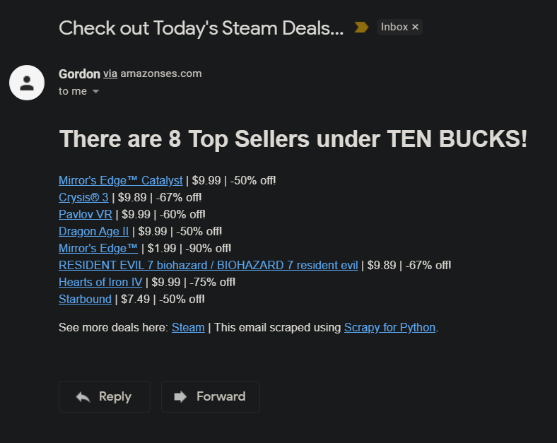

# spider-projects
 a collection of all personal web crawler projects

### Steam spider -
scrapes Steam deals from top sellers list and emails the count of deals under ten dollars to user 
-- see 'forfun' (projects folder) > forfun > spiders > prices_spider.py for spider code 
-- see 'forfun' (projects folder) > forfun > other_scripts > scrape_send.py for emailer code (with AWS SES) 

##### sample email output:

### HackerNews spider -
scrapes HackerNews article titles, source links, and upvote points 
-- see 'forfun' (projects folder) > forfun > spiders > hackernews_spider.py for spider code 
-- see 'forfun' (projects folder) > news_data.json for sample json crawler output  

