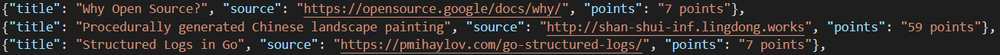
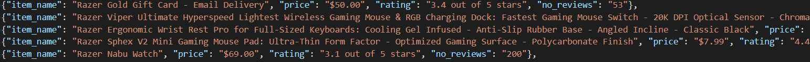

# spider-projects
 a collection of all personal web crawler projects 
 --> **UPDATE 6/17/2020:** settings.py and middlewares.py have been improved to enable ***rotating proxy*** and ***random user agent*** functionality; credit to [scrapy-rotating-proxies](https://github.com/TeamHG-Memex/scrapy-rotating-proxies) and [scrapy-user-agents](https://github.com/hyan15/crawler-demo/tree/master/crawling-basic/scrapy_user_agents)

# [1] Steam spider
scrapes Steam deals from top sellers list and emails the count of deals under ten dollars to user 
-- see 'forfun' (projects folder) > forfun > spiders > prices_spider.py for spider code 
-- see 'forfun' (projects folder) > forfun > other_scripts > scrape_send.py for emailer code (with AWS SES) 

### sample email output:

# [2] HackerNews spider
scrapes HackerNews article titles, source links, and upvote points 
-- see 'forfun' (projects folder) > forfun > spiders > hackernews_spider.py for spider code 
-- see 'forfun' (projects folder) > news_data.json for sample json crawler output  

### sample news output:

# [3] Amazon spider
scrapes Amazon market results by search term. can provide category=< some-search-term > in cmd to scrape that item's results  
-- see 'forfun' (projects folder) > forfun > spiders > amazon_spider.py for spider code 
-- see 'forfun' (projects folder) > amazon_data.json for sample json crawler output

### sample news output:

